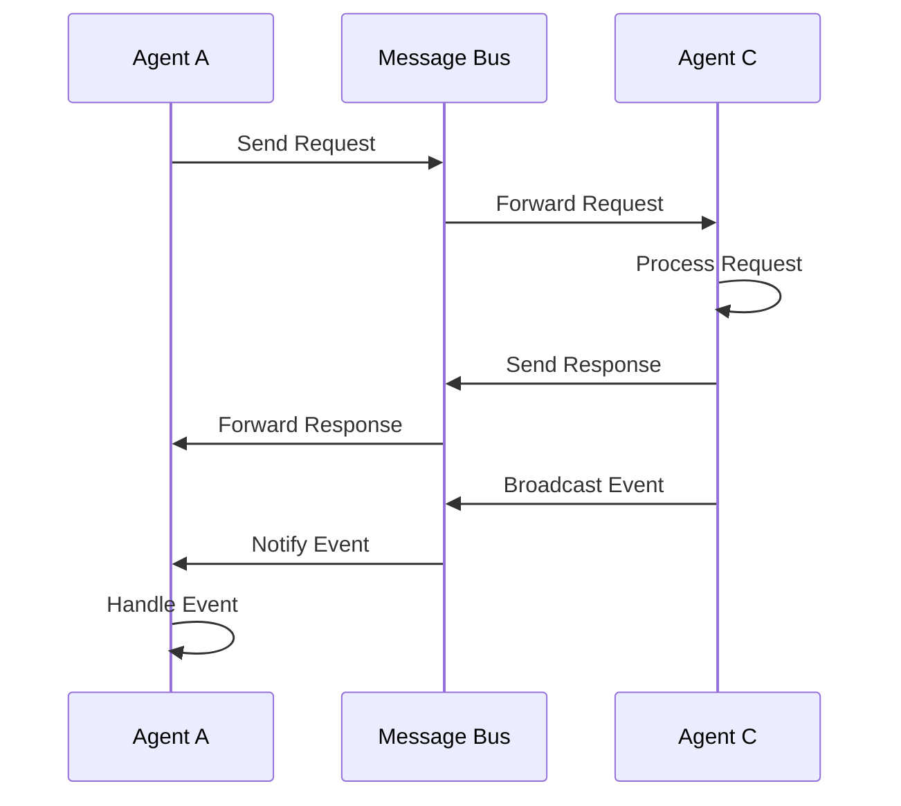

# Design Agent Communication Pattern

Create message definitions and communication flow for agent interaction.

## Agents Involved

${selectedText}

## Generate

### 1. Message Definitions

```typescript
// src/common/messages/{interaction-name}.messages.ts

import { z } from 'zod';

/**
 * Message definitions for {interaction-name}
 */

// Request message schema
export const {InteractionName}RequestSchema = z.object({
  type: z.literal('{interaction-name}_request'),
  requestId: z.string().uuid(),
  sender: z.string(),
  data: z.object({
    // Define request data structure
    parameter1: z.string(),
    parameter2: z.number().optional()
  }),
  priority: z.enum(['low', 'medium', 'high']).default('medium'),
  timeout: z.number().positive().default(30000)
});

export type {InteractionName}Request = z.infer<typeof {InteractionName}RequestSchema>;

// Response message schema
export const {InteractionName}ResponseSchema = z.object({
  type: z.literal('{interaction-name}_response'),
  requestId: z.string().uuid(),
  responder: z.string(),
  success: z.boolean(),
  data: z.unknown(),
  error: z.string().optional(),
  processingTime: z.number()
});

export type {InteractionName}Response = z.infer<typeof {InteractionName}ResponseSchema>;

// Event message schema (for broadcasting)
export const {InteractionName}EventSchema = z.object({
  type: z.literal('{interaction-name}_event'),
  eventId: z.string().uuid(),
  source: z.string(),
  timestamp: z.date(),
  data: z.unknown()
});

export type {InteractionName}Event = z.infer<typeof {InteractionName}EventSchema>;
```

### 2. Communication Handler

```typescript
// src/common/handlers/{interaction-name}.handler.ts

import { MessageBus } from '@microsoft/agent-framework';
import {
  {InteractionName}Request,
  {InteractionName}Response,
  {InteractionName}Event
} from '../messages/{interaction-name}.messages';

export class {InteractionName}Handler {
  constructor(private messageBus: MessageBus) {}

  /**
   * Send request from one agent to another
   */
  async sendRequest(
    from: string,
    to: string,
    data: {InteractionName}Request['data']
  ): Promise<{InteractionName}Response> {
    const request: {InteractionName}Request = {
      type: '{interaction-name}_request',
      requestId: generateUUID(),
      sender: from,
      data,
      priority: 'medium',
      timeout: 30000
    };

    return this.messageBus.request(to, request);
  }

  /**
   * Broadcast event to all listening agents
   */
  async broadcastEvent(
    source: string,
    data: unknown
  ): Promise<void> {
    const event: {InteractionName}Event = {
      type: '{interaction-name}_event',
      eventId: generateUUID(),
      source,
      timestamp: new Date(),
      data
    };

    await this.messageBus.publish(event);
  }

  /**
   * Subscribe to events
   */
  subscribeToEvents(
    handler: (event: {InteractionName}Event) => Promise<void>
  ): () => void {
    return this.messageBus.subscribe(
      '{interaction-name}_event',
      handler
    );
  }
}
```

### 3. Sequence Diagram



### 4. Integration Test

```typescript
// tests/integration/{interaction-name}.test.ts

import { AgentSystem } from '@microsoft/agent-framework';
import { {InteractionName}Handler } from '../../src/common/handlers/{interaction-name}.handler';

describe('{InteractionName} Communication', () => {
  let system: AgentSystem;
  let handler: {InteractionName}Handler;

  beforeAll(async () => {
    system = await setupTestAgentSystem();
    handler = new {InteractionName}Handler(system.messageBus);
  });

  it('should handle request-response pattern', async () => {
    const response = await handler.sendRequest(
      'agent-a',
      'agent-c',
      { parameter1: 'test', parameter2: 42 }
    );

    expect(response.success).toBe(true);
    expect(response.data).toBeDefined();
  });

  it('should broadcast events to subscribers', async () => {
    const events: {InteractionName}Event[] = [];
    
    const unsubscribe = handler.subscribeToEvents(async (event) => {
      events.push(event);
    });

    await handler.broadcastEvent('agent-c', { status: 'completed' });
    
    await waitFor(() => events.length > 0);
    expect(events[0].data).toEqual({ status: 'completed' });
    
    unsubscribe();
  });

  it('should handle timeouts', async () => {
    await expect(
      handler.sendRequest('agent-a', 'non-existent', {})
    ).rejects.toThrow('Timeout');
  });
});
```

### 5. Documentation

```markdown
# {InteractionName} Communication Pattern

## Overview

Communication pattern between {Agent A} and {Agent C} for {purpose}.

## Message Flow

1. **Request Phase**
   - Agent A sends request to Agent C
   - Request includes: {parameters}
   - Timeout: 30 seconds

2. **Processing Phase**
   - Agent C validates request
   - Agent C processes request
   - Agent C prepares response

3. **Response Phase**
   - Agent C sends response to Agent A
   - Response includes: {data structure}

4. **Event Broadcasting**
   - Agent C broadcasts event on completion
   - All subscribed agents receive notification

## Message Types

### Request
```typescript
{
  type: '{interaction-name}_request',
  requestId: string,
  sender: string,
  data: {
    parameter1: string,
    parameter2?: number
  }
}
```

### Response
```typescript
{
  type: '{interaction-name}_response',
  requestId: string,
  responder: string,
  success: boolean,
  data: unknown,
  error?: string
}
```

## Error Handling

- **Timeout**: Request times out after 30 seconds
- **Validation Error**: Invalid request parameters
- **Processing Error**: Error during request processing

## Monitoring

- Track request latency
- Monitor error rates
- Alert on timeout threshold
```

---

Follow messaging patterns from: #file:.github/copilot-instructions.md

Ensure type safety and proper error handling.
